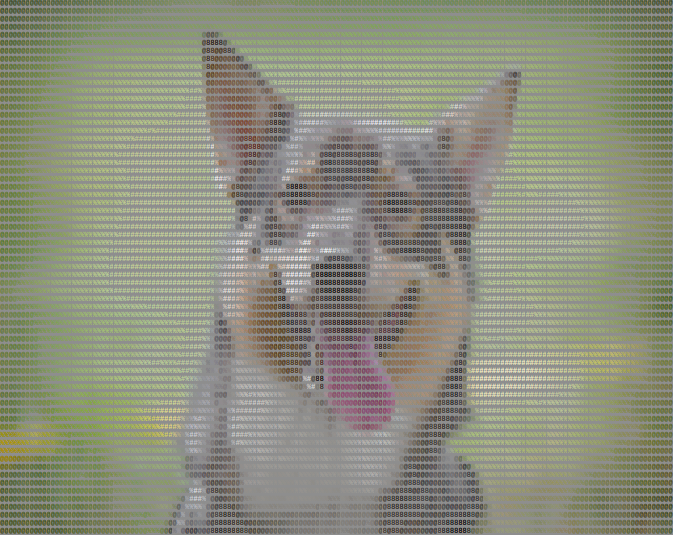
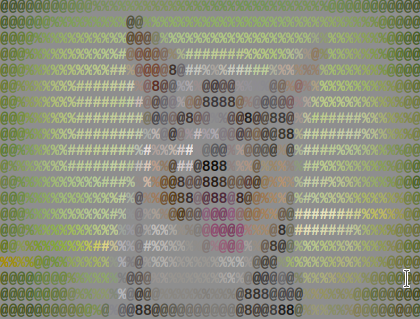
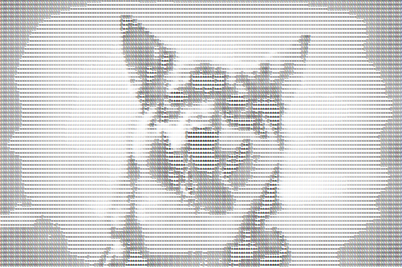
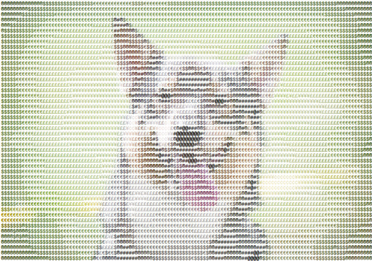
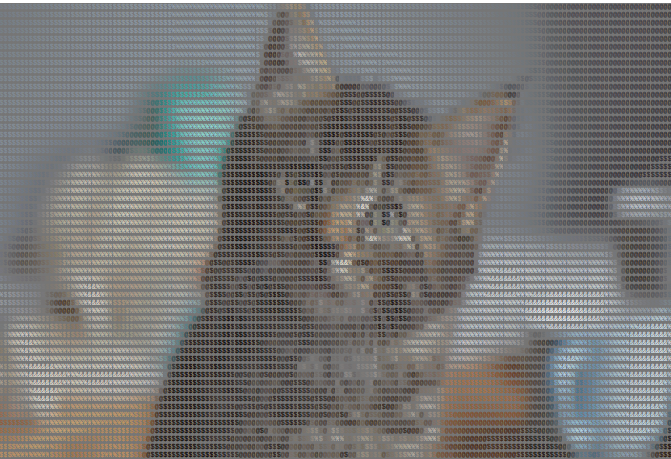
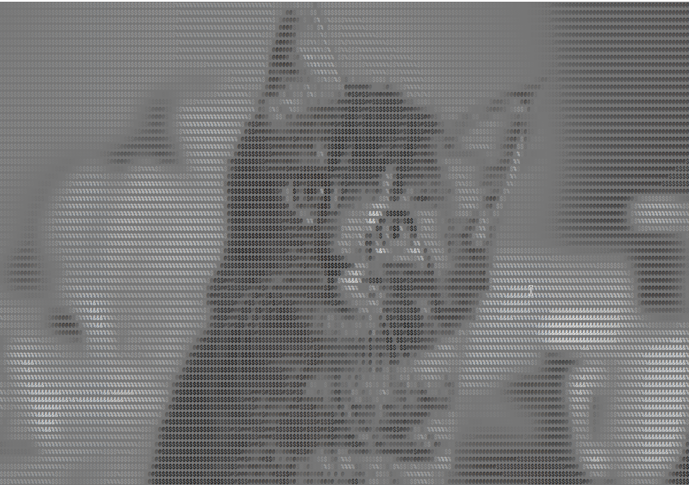

ASCII Maker
------------

### Installation


```commandline
pip install asciimaker
```

or if you dont have pip

```commandline
git clone "https://github.com/lewis-morris/asciimaker" && cd asciimaker && python setup.py install
```


### Usage
First import AsciiMaker

```python
import AsciiMaker
```

Then start using - we are setting a low block size (which increases the complexity, and using custom characters)
```python
asc = AsciiMaker.Maker(w_size=800, block_size=5, characters="8@%#")
asc.write_html("dog.jpg", "dog.html")
```



Lets lower the resolution (or increase the block size)

```python
asc = AsciiMaker.Maker(w_size=500, block_size=10, invert=False, colour=True, characters="8@%#")
asc.write_html("examples/dog.jpg", "dog1.html")

```



Or greyscale with no background colour

```python
asc = AsciiMaker.Maker(w_size=500, block_size=3, invert=False, colour=False,background=False, characters="8@%#")
asc.write_html("examples/dog.jpg", "dog2.html")

```



Again colour - but with no background colour and a new set of characters also multplying the font size (enlarging the image
)
```python
asc = AsciiMaker.Maker(w_size=500, block_size=4, invert=False, colour=True,background=False, characters="@#®$€£¥¢", font_multiplier=2)
asc.write_html("examples/dog.jpg", "dog7.html")

```




More examples 

```python
asc = AsciiMaker.Maker(colour=True,block_size=5, characters="$@$%&")
asc.write_html("examples/cat.jpg", "cat.html")

```



We can change the font from the google list of monospace fonts

```python
asc = AsciiMaker.Maker(colour=False,block_size=4, characters="$@$%&", font_multiplier=2, font="Roboto Mono")
asc.write_html("examples/cat.jpg", "cat3.html")

```



